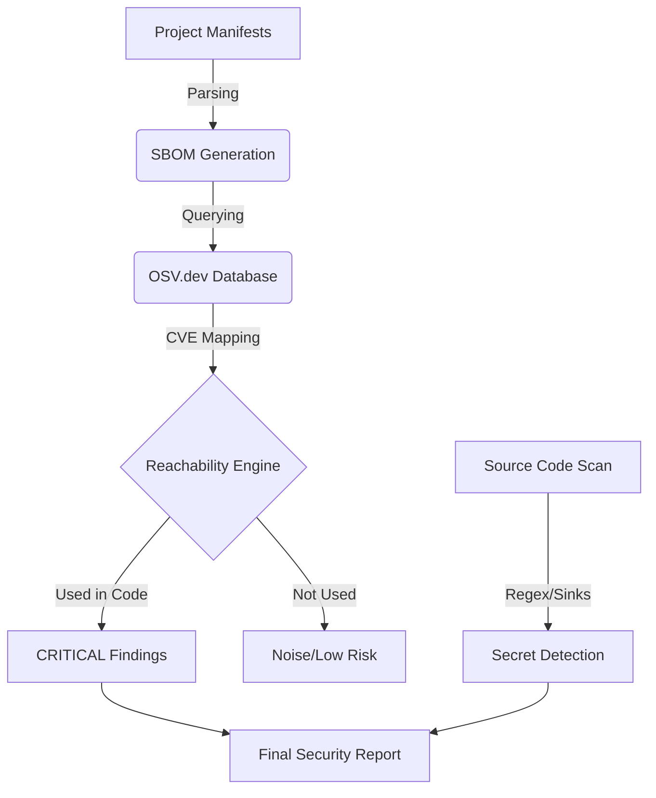

# codeScanner 🛡️

**codeScanner** is a sophisticated **Software Supply Chain Security** utility designed for deep security analysis. It doesn't just list vulnerabilities; it maps them against your actual code usage to determine **real risk**.

---

## ✨ Key Features

- **Language-Agnostic Engine**: Support for Python, Node.js, Ruby, Go, Java, and Rust.
- **Dynamic SBOM Generation**: Automatically compiles a detailed Software Bill of Materials.
- **Reachability Heuristics**: Automatically filters out "noise" vulnerabilities that are present in your vendor folder but never actually called by your code.
- **Vulnerability Intelligence**: Direct integration with the **OSV.dev** database for high-fidelity security data.
- **Secret & Danger Scanning**: Detects hardcoded credentials (API keys, tokens) and dangerous coding patterns (sinks).
- **Static Asset Security**: Scans HTML files for compromised or insecure CDN-hosted script tags.

---

## 🧠 How It Works (The Security Pipeline)



### 1. SBOM (Software Bill of Materials)
The tool starts by fingerprinting your project's ecosystem. It parses files like `package.json`, `requirements.txt`, or `go.mod` to create a structured inventory of every third-party component you are using.

### 2. CVE Mapping & Intelligence
Every component identified in the SBOM is checked against global vulnerability databases to identify known CVEs, severity ratings, and patch versions.

### 3. Reachability Heuristics (The Filter)
Typical scanners produce too many "false positives." **codeScanner** uses language-specific heuristics to check if the vulnerable parts of a library are actually **imported** or **invoked** in your source files. This allows security teams to focus on reachable exploits first.

---

## 🚀 Installation & Usage (Linux/macOS)

### Prerequisites
- Python 3.8+
- Git

### Setup
```bash
# Clone the repository (Sparse mode recommended)
git clone --filter=blob:none --sparse https://github.com/VIKAS-KUMAR-10/My_Projects.git
cd My_Projects
git sparse-checkout set code-scanner
cd code-scanner

# Run the automated setup script
chmod +x setup.sh
./setup.sh

# Activate the environment
source .venv/bin/activate
```

### Running a Scan
```bash
# Basic scan
codescanner scan /path/to/project

# Severity filtered scan
codescanner scan /path/to/project --severity HIGH
```

---

## 🏗️ Technical Architecture

- **Detector**: Fingerprints projects via marker files.
- **Parsers**: Native manifest handlers for multiple package managers.
- **Engine**: Core logic for Reachability and Pattern matching.
- **API Caller**: Asynchronous intelligence gathering from OSV.dev.
- **UI**: High-signal CLI reporting via the `Rich` framework.

---

## 🤝 Contributing
For internal architecture details or adding new language support, see [`DESIGN.md`](./DESIGN.md).
